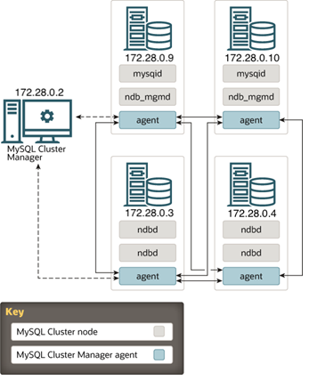

# Mysql-cluster

## Setup enviroment
Moount to cluster-mysql folder to deploy docker container
```
cd cluster-mysql
```
1. Build image 
```
docker build -t mysql-cluster .docker 
```
2. Deploy docker-compose.yml
```
docker-compose up -d
```
3. Remove docker-compose
```
docker-compose down
```
## Test connect
You can use MySQL Workbench to connect to localhost:3306 (node1) and localhost:33060 (node2) to test with sakila dataset in sql folder.
## Some bug
When build docker-compose, sometime will error:
Access Denied for User 'root'@'localhost' (using password: YES)
Restart several times to pass bug or find how to fix. [Currently, I can not fix :(((]

## Reference
Source: [rsegecin - mysql-cluster](https://github.com/rsegecin/mysql-cluster)
[NDB Cluster Overview](https://docs.oracle.com/cd/E17952_01/mysql-5.6-en/mysql-cluster-overview.html)